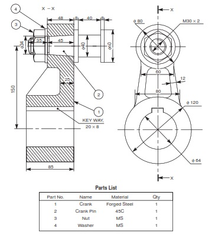
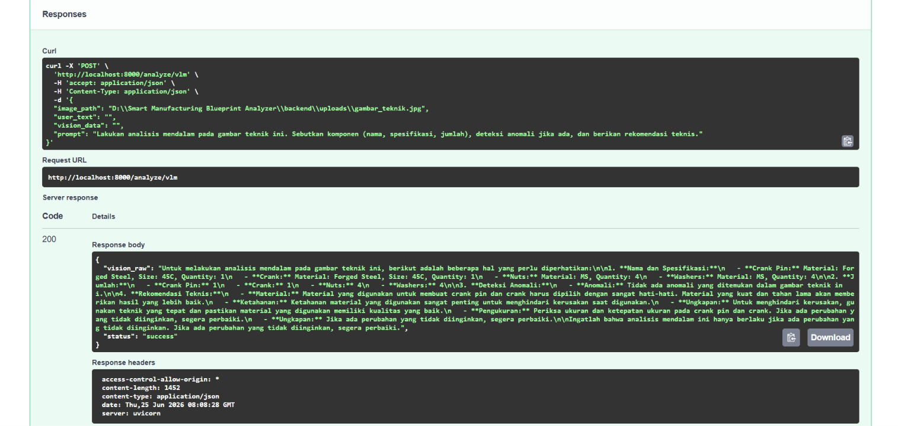

# Smart Manufacturing Blueprint Analyzer

A local, privacy-first AI system for analyzing technical drawings and manufacturing blueprints. Powered by a **Dual-Engine GGUF** architecture for ultra-fast, CPU-optimized inference with minimal memory footprint.

## 🚀 Key Features
- **Dual-Engine Orchestrator**:
  - **Vision Engine** — Qwen2-VL 2B (GGUF) with multimodal projector (`mmproj`) for deep visual extraction from technical drawings.
  - **Reasoning Engine** — Qwen 2.5 0.5B (GGUF) for structuring raw visual data into professional manufacturing reports.
- **Ultra-Lightweight** — No `torch` or `transformers` required. The entire ML stack runs via native `llama-server.exe` binaries (~2 GB total RAM).
- **Modern Glassmorphism UI** — Clean, responsive, and premium web interface built with Bootstrap 5.
- **Privacy First** — All data is processed locally. No cloud dependency.

## 📂 Project Structure
```text
/
├── backend/
│   ├── bin/             # Native inference binaries (llama-server.exe)
│   ├── uploads/         # Temporary upload directory
│   ├── main.py          # FastAPI orchestrator (Dual-Engine)
│   └── requirements.txt
├── frontend/
│   └── index.html       # Web interface
├── models/              # GGUF model weights & vision projector
├── scripts/
│   └── download_light_model.py
└── README.md
```

## 🛠️ Setup & Installation

1.  **Create Virtual Environment:**
    ```powershell
    cd backend
    python -m venv venv
    .\venv\Scripts\activate
    ```

2.  **Install Dependencies (lightweight):**
    ```powershell
    pip install -r requirements.txt
    ```

3.  **Download Model Weights:**
    Run the automated download script to fetch the Vision and Reasoning GGUF models:
    ```powershell
    python ../scripts/download_light_model.py
    ```
    This downloads three files into the `models/` directory:
    - `qwen2.5-0.5b-instruct-q4_k_m.gguf` (~468 MB)
    - `Qwen2-VL-2B-Instruct-Q4_K_M.gguf` (~1.5 GB)
    - `mmproj-Qwen2-VL-2B-Instruct-f16.gguf` (~1.2 GB)

## 🖥️ Running the Application

Start the FastAPI backend — both GGUF engines are managed automatically in the background:

```powershell
cd backend
.\venv\Scripts\activate
uvicorn main:app --reload
uvicorn main:app --host 0.0.0.0 --port 8000 --reload
```

Then open `frontend/index.html` in your browser.

## � Step-by-Step Analysis Example

The system uses a two-stage process to ensure focus and efficiency.

### 1. Vision Analysis (`/analyze/vlm`)
In this stage, the **Qwen2-VL** model focuses purely on the visual content of the image.

**Input Image:**


**Example Request:**
```json
{
  "image_path": "D:\\Smart Manufacturing Blueprint Analyzer\\backend\\uploads\\gambar_teknik.jpg",
  "user_text": "",
  "vision_data": "",
  "prompt": "Lakukan analisis mendalam pada gambar teknik ini. Sebutkan komponen (nama, spesifikasi, jumlah), deteksi anomali jika ada, dan berikan rekomendasi teknis."
}
```

### 2. Reasoning Refinement (`/analyze/llm`)
After Stage 1, the **Qwen 2.5** model takes the raw vision output and structures it into a professional technical report based on your specific requirements.




**Example Response (`vision_raw`):**
```json
{
  "vision_raw": "Untuk melakukan analisis mendalam pada gambar teknik ini, berikut adalah beberapa hal yang perlu diperhatikan:\n\n1. **Nama dan Spesifikasi:**\n   - **Crank Pin:** Material: Forged Steel, Size: 45C, Quantity: 1\n   - **Crank:** Material: Forged Steel, Size: 45C, Quantity: 1\n   - **Nuts:** Material: MS, Quantity: 4\n   - **Washers:** Material: MS, Quantity: 4\n\n2. **Jumlah:**\n   - **Crank Pin:** 1\n   - **Crank:** 1\n   - **Nuts:** 4\n   - **Washers:** 4\n\n3. **Deteksi Anomali:**\n   - **Anomali:** Tidak ada anomali yang ditemukan dalam gambar teknik ini.\n\n4. **Rekomendasi Teknis:**\n   - **Material:** Material yang digunakan untuk membuat crank pin dan crank harus dipilih dengan sangat hati-hati. Material yang kuat dan tahan lama akan memberikan hasil yang lebih baik.\n   - **Ketahanan:** Ketahanan material yang digunakan sangat penting untuk menghindari kerusakan saat digunakan.\n   - **Ungkapan:** Untuk menghindari kerusakan, gunakan teknik yang tepat dan pastikan material yang digunakan memiliki kualitas yang baik.\n   - **Pengukuran:** Periksa ukuran dan ketepatan ukuran pada crank pin dan crank. Jika ada perubahan yang tidak diinginkan, segera perbaiki.\n   - **Ungkapan:** Jika ada perubahan yang tidak diinginkan, segera perbaiki.\n\nIngatlah bahwa analisis mendalam ini hanya berlaku jika ada perubahan yang tidak diinginkan. Jika ada perubahan yang tidak diinginkan, segera perbaiki.",
  "status": "success"
}
```

## 📝 How It Works
1. **Upload** a technical blueprint.
2. **Vision Stage**: The AI extracts raw observational data (Stage 1).
3. **Reasoning Stage**: Click **"Susun Laporan Teknis"** (optional) to generate a formatted engineering report in Indonesian (Stage 2).

## ⚖️ License
MIT License